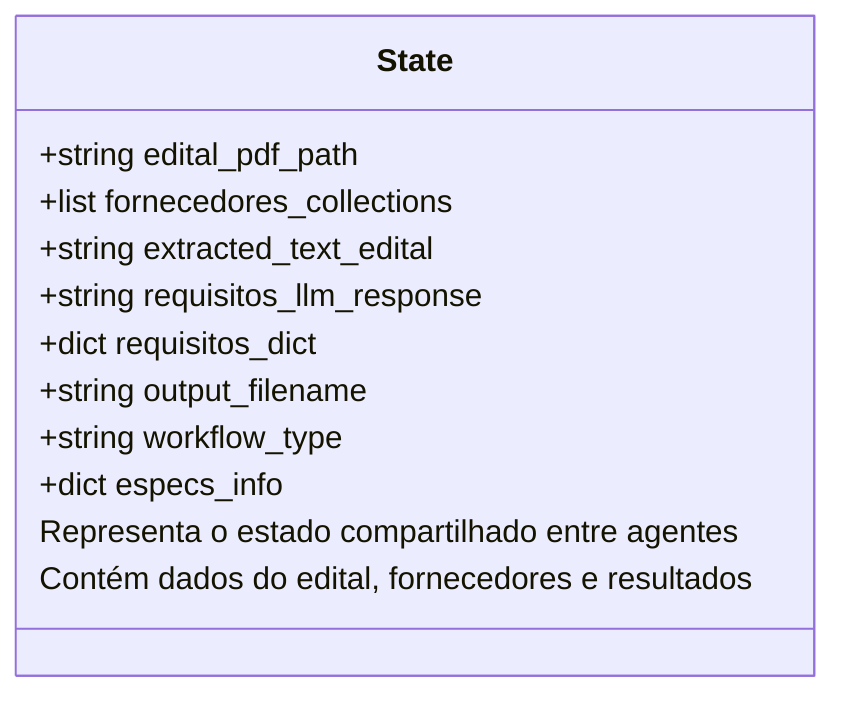
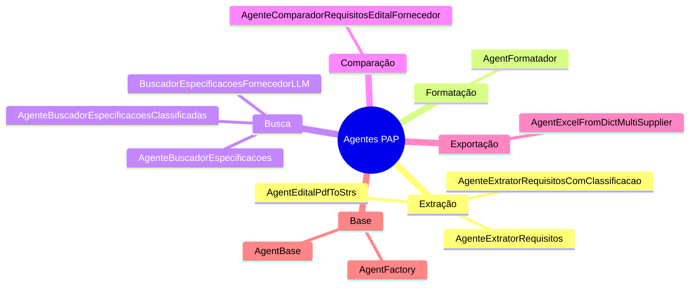
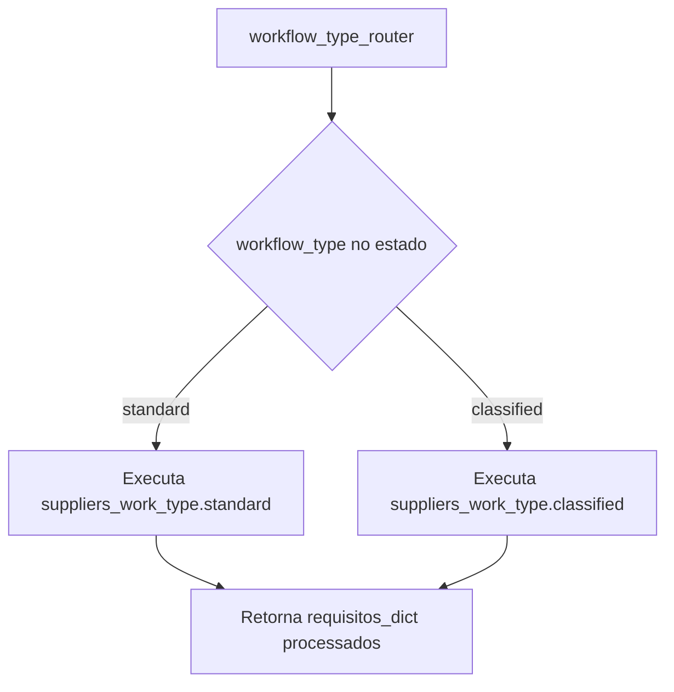
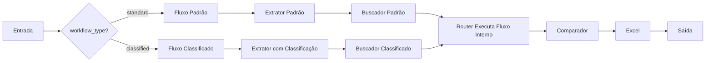

# Fluxograma do Workflow Multiagente PAP

## Visão Geral
Este fluxograma representa o workflow multiagente para processamento de licitações (PAP - Processo de Análise de Propostas), mostrando dois fluxos principais: **Standard** e **Classified**.

## Fluxograma Principal


## Detalhamento dos Fluxos de Fornecedores

### Fluxo Standard
```mermaid
flowchart TD
    STANDARD_START([Início Fluxo Standard]) --> PHASE1[FASE 1: Processar Datasheets]
    
    %% FASE 1: Processamento de Datasheets
    PHASE1 --> DATASHEET_LOOP[Para cada Fornecedor]
    DATASHEET_LOOP --> CHECK_TECH{É Técnico?}
    
    CHECK_TECH -->|Sim| PROCESS_TECH[Processar Datasheet Técnico]
    CHECK_TECH -->|Não| SKIP_TECH[Pular para Próximo]
    
    PROCESS_TECH --> SAVE_MODEL[Salvar Modelo do Produto<br/>modelos_produtos[fornecedor]]
    SAVE_MODEL --> NEXT_TECH[Próximo Fornecedor]
    SKIP_TECH --> NEXT_TECH
    
    NEXT_TECH --> MORE_TECH{Mais Fornecedores?}
    MORE_TECH -->|Sim| DATASHEET_LOOP
    MORE_TECH -->|Não| PHASE2[FASE 2: Processar Hedex]
    
    %% FASE 2: Processamento de Hedex
    PHASE2 --> HEDEX_LOOP[Para cada Fornecedor]
    HEDEX_LOOP --> CHECK_HEDEX{É Teórico/Hedex?}
    
    CHECK_HEDEX -->|Sim| CHECK_ASSOCIATED{Tem Datasheet Associado?}
    CHECK_HEDEX -->|Não| SKIP_HEDEX[Pular para Próximo]
    
    CHECK_ASSOCIATED -->|Sim| USE_MODEL[Usar Modelo Salvo<br/>modelo_datasheet = modelos_produtos[datasheet_associado]]
    CHECK_ASSOCIATED -->|Não| PROCESS_NORMAL[Processamento Normal]
    
    USE_MODEL --> MODIFY_TEXT[Modificar Texto com Modelo<br/>Adicionar modelo ao texto e busca]
    MODIFY_TEXT --> EXECUTE_LLM1[Executar LLM Teórico]
    EXECUTE_LLM1 --> REPLACE_MODEL[Substituir Modelo no Resultado<br/>resultado["produto_fornecedor"] = modelo_datasheet]
    REPLACE_MODEL --> NEXT_HEDEX[Próximo Fornecedor]
    
    PROCESS_NORMAL --> EXECUTE_LLM2[Executar LLM Normal]
    EXECUTE_LLM2 --> NEXT_HEDEX
    SKIP_HEDEX --> NEXT_HEDEX
    
    NEXT_HEDEX --> MORE_HEDEX{Mais Fornecedores?}
    MORE_HEDEX -->|Sim| HEDEX_LOOP
    MORE_HEDEX -->|Não| STANDARD_END([Fim Fluxo Standard])
    
    classDef processClass fill:#1e40af,stroke:#93c5fd,stroke-width:2px,color:#ffffff
    classDef decisionClass fill:#dc2626,stroke:#fca5a5,stroke-width:2px,color:#ffffff
    classDef startEndClass fill:#059669,stroke:#6ee7b7,stroke-width:3px,color:#ffffff
    classDef phaseClass fill:#7c2d12,stroke:#fed7aa,stroke-width:3px,color:#ffffff
    
    class DATASHEET_LOOP,PROCESS_TECH,SAVE_MODEL,HEDEX_LOOP,USE_MODEL,MODIFY_TEXT,EXECUTE_LLM1,EXECUTE_LLM2,REPLACE_MODEL,PROCESS_NORMAL,SKIP_TECH,SKIP_HEDEX,NEXT_TECH,NEXT_HEDEX processClass
    class CHECK_TECH,CHECK_HEDEX,CHECK_ASSOCIATED,MORE_TECH,MORE_HEDEX decisionClass
    class STANDARD_START,STANDARD_END startEndClass
    class PHASE1,PHASE2 phaseClass
```

### Fluxo Classified


## Estados do Workflow



## Agentes Disponíveis



## Configurações de Modelo

O workflow suporta diferentes configurações de modelo:

- **Extração**: Modelos para extração de requisitos
- **Comparação**: Modelos para comparação detalhada
- **Busca**: Modelos para busca semântica
- **Formatação**: Modelos para formatação de dados

### Provedores Suportados:
- **Google (Gemini)**: Modelos Gemini
- **Anthropic**: Claude 3.5 Sonnet
- **OpenAI**: GPT-4o
- **Groq**: Modelos otimizados para velocidade

## Funcionamento do Router de Fornecedores

O **Router de Fornecedores** (`workflow_type_router`) é um componente central que executa internamente os fluxos Standard ou Classified baseado no `workflow_type` definido no estado. Ele não é uma decisão condicional no grafo, mas sim um agente que contém a lógica de ambos os fluxos.



## Fluxo de Decisão Principal



## Observações Importantes

1. **Dois Fluxos Principais**: O sistema suporta fluxo `standard` (original) e `classified` (otimizado)
2. **Processamento Inteligente**: No fluxo classificado, se o datasheet atende aos requisitos, os hedex associados não são processados
3. **Consistência de Modelos**: O sistema garante que o modelo do produto seja consistente entre datasheet e hedex
4. **Configuração Flexível**: Suporte a múltiplos provedores de LLM com configuração dinâmica
5. **Logging Detalhado**: Cada etapa é logada para rastreabilidade e debugging
