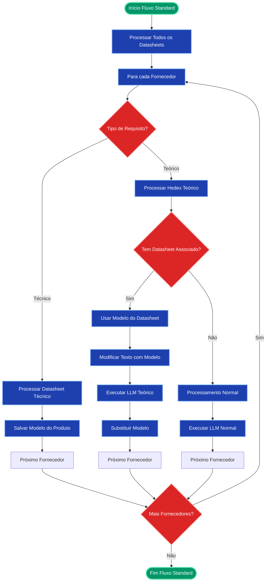

# Fluxograma do Workflow Multiagente PAP

## Visão Geral
Este fluxograma representa o workflow multiagente para processamento de licitações (PAP - Processo de Análise de Propostas), mostrando dois fluxos principais: **Standard** e **Classified**.

## Fluxograma Principal

## Detalhamento dos Fluxos de Fornecedores

### Fluxo Standard

### Fluxo Classified

## Estados do Workflow

## Agentes Disponíveis

## Configurações de Modelo

O workflow suporta diferentes configurações de modelo:

- **Extração**: Modelos para extração de requisitos
- **Comparação**: Modelos para comparação detalhada
- **Busca**: Modelos para busca semântica
- **Formatação**: Modelos para formatação de dados

### Provedores Suportados:
- **Google (Gemini)**: Modelos Gemini
- **Anthropic**: Claude 3.5 Sonnet
- **OpenAI**: GPT-4o
- **Groq**: Modelos otimizados para velocidade

## Funcionamento do Router de Fornecedores

O **Router de Fornecedores** (`workflow_type_router`) é um componente central que executa internamente os fluxos Standard ou Classified baseado no `workflow_type` definido no estado. Ele não é uma decisão condicional no grafo, mas sim um agente que contém a lógica de ambos os fluxos.

## Fluxo de Decisão Principal

## Observações Importantes

1. **Dois Fluxos Principais**: O sistema suporta fluxo `standard` (original) e `classified` (otimizado)
2. **Processamento Inteligente**: No fluxo classificado, se o datasheet atende aos requisitos, os hedex associados não são processados
3. **Consistência de Modelos**: O sistema garante que o modelo do produto seja consistente entre datasheet e hedex
4. **Configuração Flexível**: Suporte a múltiplos provedores de LLM com configuração dinâmica
5. **Logging Detalhado**: Cada etapa é logada para rastreabilidade e debugging
